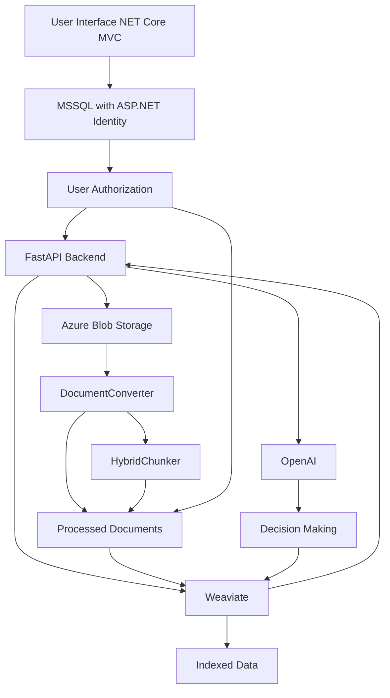

# Topicality Weaviate API

#Warning!! This project is in alpha stage. With bugs and problems. DO NOT test the endpoints with sensitive data, copyrighted documents and unlawful content.

## Overview

The Topicality Weaviate API is a AI-empowered service designed to process and manage information contexts and documents. It integrates with Weaviate for vector search capabilities, Azure Blob Storage for document storage, and OpenAI for advanced decision-making and context analysis. The API supports various functionalities, including document uploads, context comparisons, and decision-making flows.

## Features

- **Document Processing**: Upload and process documents, converting them into text chunks for indexing.
- **Context Comparison**: Compare different contexts from documents or notes to analyze relationships and compatibility.
- **Decision-Making Flows**: Create decision trees based on context analysis to guide users through complex information landscapes.
- **User Authorization**: Managed through MSSQL with ASP.NET Identity for secure access control.
- **Integration with .NET Core MVC UI**: Seamless interaction with a frontend application for user inputs and visualizations.

## Architecture

The system is composed of several key components that work together to provide a comprehensive solution for managing and analyzing information contexts:

1. **User Interface (UI)**: A .NET Core MVC application where users can upload documents, submit notes, and interact with the system.
2. **FastAPI Backend**: The core service handling API requests, document processing, and interactions with other services.
3. **Weaviate**: A vector search engine for storing and querying document chunks and metadata.
4. **Azure Blob Storage**: Temporary storage for uploaded documents before processing.
5. **OpenAI**: Used for generating responses and making decisions based on context.
6. **MSSQL with ASP.NET Identity**: Manages user authorization and authentication.
7. **Document Processing Components**: Includes `DocumentConverter` for converting documents to text and `HybridChunker` for splitting text into chunks.

## System Diagram

## Setup Instructions

To set up the Topicality Weaviate API, follow these steps:

1. **Clone the Repository**: Clone this repository to your local machine.
2. **Install Dependencies**: Use `pip` to install the required Python packages.
3. **Configure Environment Variables**: Set up the necessary environment variables for Azure Blob Storage and other services.
4. **Run the Application**: Start the FastAPI server and ensure all connected services are running.

## Usage

- **Upload Documents**: Use the UI or API endpoints to upload documents for processing.
- **Submit Notes**: Input daily notes or context information for analysis.
- **Compare Contexts**: Utilize the comparison endpoints to analyze relationships between different contexts.
- **Create Decision Flows**: Build decision-making flows to navigate through complex information.

## Contributing

Contributions are welcome! Please fork the repository and submit a pull request with your changes.

## License
This project is licensed under the [AGPLv3](LICENSE) with additional 
restrictions for commercial use. Contact me for commercial licensing.

## Use Cases and Benefits

In any company or department, regardless of how well-structured information and policies are, employees are often inundated with emails, Teams messages, Jira tasks, Git comments, meetings, conversations, new documents, new approaches, and changes. Sometimes, this information gets lost or overlooked. Previously, I used to jot down notes in Notepad++ to keep track of temporary information. Now, I use this system to enter text into the "notes" category, ensuring that even tiny pieces of information are easily retrievable.

As a programmer, I frequently need to read through requirement documents, analysis reports, integration documentation, third-party codebases, and past Jira tasks. With this system, I can compile all relevant information under one category and work with it by asking specific questions.

Often, it becomes evident that some logic contradicts another. With this system, I can compare two categories containing multiple documents each, pinpointing exactly where the logic conflicts.

When designing something new, fast prototyping is invaluable. This system allows me to create "flows" for rapid prototyping and decision-making.

This system's utility extends beyond the company level. If I want to showcase my 20 years of experience in IT, I can bulk all relevant information, conversations, and code into one category and send it to a recruiter for investigation or comparison, rather than compiling an AI-assisted CV and cover letter yet again.

Moreover, if I want to find my soulmate, I can create a category of my favorite literature, music, and pictures, allowing others to discover the essence of who I am, rather than advertising myself.

This system is designed for these purposes, and I believe it offers significant value.

## Future Improvements

Although the project is submitted for the AI Hackathon, it will continue to be improved beyond this event. Apart from general cleanup and refactoring, the next steps planned for implementation are:

- **Sharing Categories and Documents**: Enable sending categories with texts and documents to others, along with predefined prompts, queries, and saved answers.
  - **Use Case**: For example, if one document contradicts another in a company's actions, this information can be easily highlighted. The same applies to flows, as they can serve as predefined "prototypes" of actions, allowing others to more easily grasp the ideas or identify issues in current processes.

- **Multimodality**: Incorporate image, audio, and video indexing to enhance the system's capabilities.

- **Web Integration for Comparisons and Flows**: Extend comparisons and flows to the web using structured outputs for enhanced presentation experiences.

## Contact

For any questions or support, please contact the maintainers through the repository issues page.
